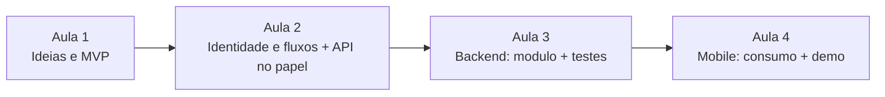
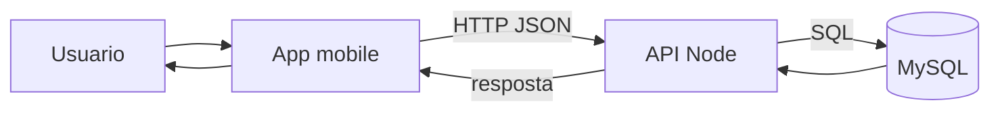

# Roteiro de 4 encontros — Projeto integrado (API + app mobile)

Publico: alunos iniciantes em backend e mobile, com o repositorio base (`api-aulas-backend` + `mobile-app`).

> **Figuras prontas para slide:** se existirem, use os arquivos em `docs/assets/roteiro-cronograma-4-aulas.png` e `docs/assets/roteiro-fluxo-mvp.png` (voce pode copia-los para essa pasta). Abaixo, os mesmos conteudos em **Mermaid** (o GitHub renderiza automaticamente no README/MD do repositorio).

---

## Visao geral do cronograma (diagrama)

---

## Encontro 1 — Problema, ideias e escolha do MVP (90 a 120 min)

### Objetivos
- Alinhar **contexto de uso** e **usuario-alvo**
- Gerar **3 ideias** de evolucao do app com criterio unico
- **Escolher 1 ideia** com matriz simples
- Fechar o **MVP** em 3 funcionalidades no maximo

### Roteiro do professor (tempo sugerido)
| Tempo | Atividade |
|------|-----------|
| 10 min | Apresentar padrao do repo: `rota -> controller -> service -> repository` (API) e telas + servicos (mobile) |
| 20 min | Dinamica: pergunta-guia — *Quem e o usuario e qual dor o app resolve?* |
| 25 min | Cada time escreve **3 ideias** (problema + 1 funcionalidade principal + 1 conexao com API obrigatoria) |
| 20 min | Matriz de decisao: impacto vs esforco vs risco tecnico; escolher 1 ideia |
| 15 min | Exercicio: 1 paragrafo **por que essa ideia** + lista **backlog** (o que fica fora do MVP) |
| 10 min | Fechamento: professor valida **viabilidade** no prazo e **clareza** do escopo |

### Entregaveis (por grupo, escrito)
- Paragrafo de contexto
- 3 ideias + matriz
- 1 ideia escolhida com justificativa
- MVP em ate 3 funcionalidades + backlog

### Tarefa de casa
- Preencher **nome provisorio** + **paleta** (3 cores) + 2 frases sobre publico

---

## Encontro 2 — Nome, identidade, fluxos e especificacao (90 a 120 min)

### Objetivos
- Definir **identidade** (nome, cores, tom)
- Descrever **fluxos** em texto (2 fluxos minimo)
- Descrever **dados e API** (entidades, rotas, payloads)

### Roteiro do professor
| Tempo | Atividade |
|------|-----------|
| 10 min | Revisao rapida do MVP (cortar o que nao couber) |
| 20 min | Oficina: nome, cores, 2 telas principais (o que o usuario ve e o que acontece se der erro) |
| 30 min | Escrita de fluxo: *Usuario faz A -> app chama B -> API responde C -> tela D* (2 fluxos) |
| 30 min | Especificacao minima: tabela de **entidade/campos** + lista de **endpoints** (metodo, rota, corpo) |
| 10 min | Check: cada fluxo bate com pelo menos 1 endpoint? |

### Entregaveis
- 1 mini-documento: nome final (ou quase) + paleta
- 2 fluxos em texto
- Tabela de entidades e lista de endpoints (rascunho)

### Tarefa de casa
- Validar **no Insomnia/Postman** 1 rota existente (login ou health) + esboçar 1 rota nova no papel

### Diagrama do fluxo do MVP (referencia)

---

## Encontro 3 — Implementacao backend (API) + testes (90 a 120 min)

### Objetivos
- Criar **1 modulo completo** (ex.: pessoas) no padrao do projeto
- Rodar com **banco** e testar com cliente HTTP
- Garantir **erros** claros (400/404/409)

### Roteiro do professor
| Tempo | Atividade |
|------|-----------|
| 15 min | Relembrar camadas: `repositories` (SQL) / `services` (regras) / `controllers` + `routes` |
| 45 min | Implementacao guiada: `POST` + `GET` (e opcional `GET :id`) |
| 20 min | Testes com Insomnia: sucesso, validacao, conflito |
| 20 min | Se houver deploy: apontar variaveis de ambiente; senao, rodar local |

### Entregaveis
- Rotas funcionando
- Exemplos de request/response no README do grupo (ou comentario curto no PR)

### Tarefa de casa
- Documentar 3 casos de teste (feliz, validacao, nao encontrado)

---

## Encontro 4 — App mobile: telas, consumo da API, demo final (90 a 120 min)

### Objetivos
- Consumir os endpoints com **fetch** (servico) + 1-2 telas
- Exibir estados: **carregando / erro / lista vazia**
- Fazer **demo** e retrospectiva

### Roteiro do professor
| Tempo | Atividade |
|------|-----------|
| 15 min | Relembrar: `apiConfig` + `services` + telas + navegacao |
| 50 min | Implementacao: tela de lista + tela de cadastro (ou uma so com as duas acoes) |
| 20 min | Teste em aparelho ou web (conforme setup da turma) |
| 20 min | Demo por grupo (5 min cada) + retrospectiva: 1 aprendizado tecnico + 1 de grupo |

### Entregaveis
- App navegavel com pelo menos 1 fluxo completo
- Pequena secao "como rodar" no README do grupo

### Criterio de conclusao do curso
- Fluxo **login** OU cadastro (ja existente) + **1 recurso** do MVP integrado
- Todos os integrantes sabem explicar **1 decisao** de arquitetura (por que a camada service existe, por exemplo)

---

## Ritual semanal (recomendado)
1. **Planejamento (10 min):** o que entrega hoje?  
2. **Implementacao**  
3. **Revisao (10 min):** demo + 1 ajuste para a proxima aula

---

## Recursos do repositorio base
- API: [api-aulas-backend/README.md](../api-aulas-backend/README.md)  
- Mobile: [mobile-app/README.md](../mobile-app/README.md)  
- Tutoriais API (pessoas): `api-aulas-backend/docs/tutorials/`  
- Tutoriais mobile: `mobile-app/docs/`

---

## Anexo — Matriz de decisao (copiar para o quadro)

| Criterio | Peso (opcional) | Ideia A | Ideia B | Ideia C |
|----------|------------------|--------|--------|--------|
| Impacto para o usuario | 1-5 | | | |
| Esforco no prazo (menor = melhor) | 1-5 | | | |
| Risco tecnico (menor = melhor) | 1-5 | | | |
| Uso de API (obrigatorio) | sim/nao | | | |

Desempate: clareza do fluxo principal e capacidade de testar no fim do curso.
